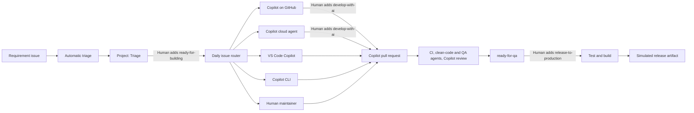

# iCSU MiniHack: Human-governed AI SDLC

Build and operate a small hotel booking system while GitHub, GitHub Copilot, VS Code, and GitHub Actions move one requirement from intake to a simulated production release.

This repository is both the **working reference implementation** and the **automation kit** for a self-led 90-minute hack. Attendees begin in an empty repository, copy only the AI SDLC kit, and use Copilot to create the application and deliver a change.

## What the hack proves

- Structured requirements enter through GitHub Issues and GitHub Projects.
- Explainable automation classifies area, kind, priority, and complexity.
- A human approves work with `ready-for-building`.
- A daily router recommends the best lane: VS Code Copilot, Copilot on GitHub, Copilot CLI, cloud agent, or a human.
- A second human gate, `develop-with-ai`, delegates approved GitHub-hosted work to Copilot.
- Copilot opens a pull request; CI, the `clean-code` and `qa` agents, and Copilot code review provide distinct validation evidence.
- A completed Copilot review moves the linked issue to `ready-for-qa`.
- A human adds `release-to-production`; Actions reruns tests and creates a release artifact without deploying anywhere.



## Reference application

Northstar Hotel is a deliberately small vertical slice:

- ASP.NET Core 8 minimal API
- EF Core 8 with an automatically seeded local SQLite database
- React, TypeScript, and Vite single-page UI
- Room availability, booking, booking conflict prevention, booking list, and cancellation
- xUnit API integration tests

### Run locally

Prerequisites: [.NET 8 SDK](https://dotnet.microsoft.com/download/dotnet/8.0), [Node.js 22 LTS](https://nodejs.org/), and VS Code.

Terminal 1:

```powershell
dotnet run --project src\HotelBooking.Api --urls http://localhost:5050
```

Terminal 2:

```powershell
Set-Location src\hotel-booking-web
npm install
npm run dev
```

Open `http://localhost:5173`. The API creates `hotel-booking.db` on first run and idempotently seeds six rooms.

### Validate

```powershell
dotnet test HotelBooking.slnx
node --test .github\scripts\issue-automation.test.js
Set-Location src\hotel-booking-web
npm run lint
npm run build
```

## Start the hack

1. Organizers: follow the [Facilitator guide](docs/FACILITATOR-GUIDE.md).
2. Attendees and repository administrators: follow the unified [setup and 90-minute attendee guide](docs/ATTENDEE-GUIDE.md).
3. Everyone: use the [Workflow reference](docs/WORKFLOW.md) and [Phase 3 sample issue library](docs/SAMPLE-ISSUE-LIBRARY.md).

The automation is workshop-safe by design: deterministic triage, explicit human gates, dedicated token boundaries, least-privilege workflow permissions, and no real deployment.
