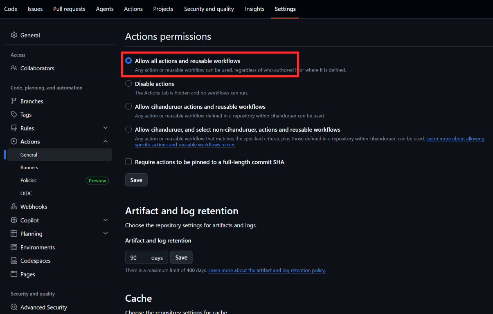
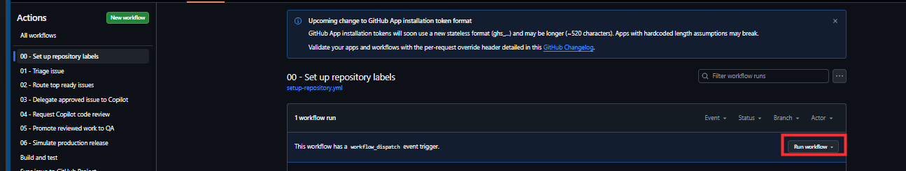
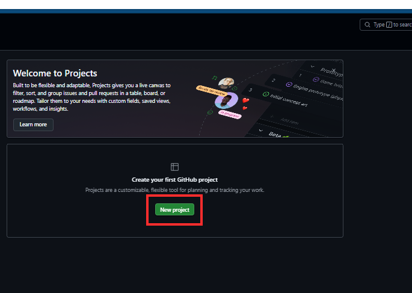
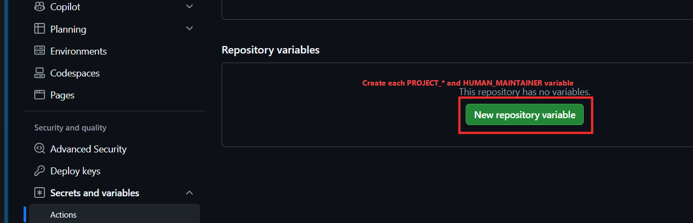
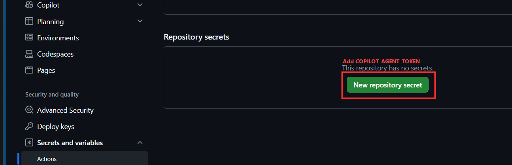
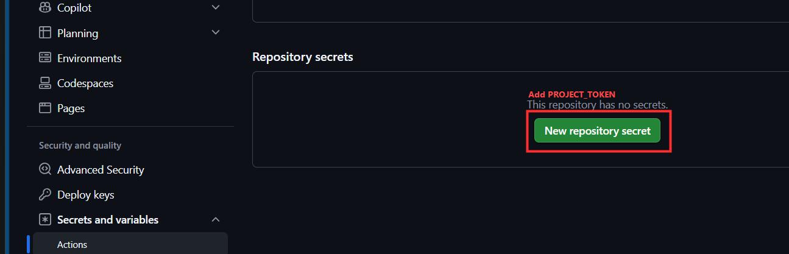
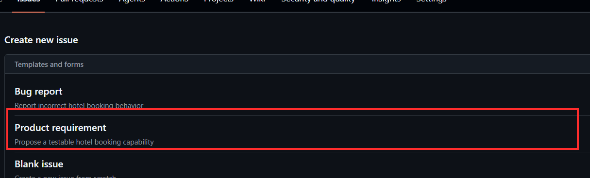

# 90-minute self-led attendee guide

## Mission

Start in an empty repository and deliver one Northstar Hotel requirement through this lifecycle:

`Issue -> triage -> human approval -> route -> implementation -> Copilot review -> QA -> simulated release`

Keep moving when a checkpoint passes. Use the recovery path only when it does not.

## Before the 90-minute clock - Complete GitHub setup

Complete this section once for your workshop repository before starting Phase 0. If the facilitator manages organization tokens centrally, complete the visible repository settings and ask the facilitator to add the two secrets.

### A. Create the empty repository and copy the workshop kit

1. Create an empty GitHub repository named `northstar-hotel-<your-handle>`. Do not initialize it with a README.
2. Clone it and open it in VS Code:

   ```powershell
   gh repo clone <OWNER>/northstar-hotel-<your-handle>
   Set-Location northstar-hotel-<your-handle>
   code .
   ```

3. Copy the workshop kit without copying the reference application:

   ```powershell
   git remote add workshop <WORKSHOP_REPOSITORY_GIT_URL>
   git fetch workshop main
   git checkout workshop/main -- .github .vscode .editorconfig .gitignore .npmrc
   git add .
   git commit -m "Add iCSU MiniHack AI SDLC kit"
   git push -u origin main
   ```

**Expected evidence:** the repository contains `.github`, `.vscode`, `.editorconfig`, `.gitignore`, and `.npmrc`, but does not contain a `src` folder.

**Recovery:** if `git checkout workshop/main` fails, download the workshop repository ZIP and copy only those five paths.

### B. Configure the mandatory NPM feed

Run:

```powershell
npm config set registry https://packagefeedproxy.microsoft.io/npm/
npm config get registry
```

The second command must return `https://packagefeedproxy.microsoft.io/npm/`. Do not bypass NPM Minimum Release controls; use the approved security exception process for an urgently required unavailable package version.

### C. Enable repository capabilities

In repository **Settings**:

1. Enable GitHub Actions.
2. Enable Issues.
3. Confirm Copilot cloud agent access for the repository.
4. Confirm the organization policy allows Copilot code review.
5. Optional but recommended: create a branch ruleset for `main` requiring the `validate` check.
6. Optional production-style review: enable **Automatically request Copilot code review** in a branch ruleset. The included workflow also requests Copilot when a non-draft pull request opens.

Copilot code review submits comments; it does not approve a pull request or replace required human approval.



The red rectangles identify the repository areas used to enable Issues, configure the `main` ruleset, verify Actions, and review Copilot access.

### D. Create repository labels

Open **Actions > 00 - Set up repository labels > Run workflow**.



Select **Run workflow** in the highlighted control and run it from `main`.

**Expected evidence:** the workflow succeeds and Issues shows labels from `.github/labels.json`, including `status:triaged`, `ready-for-building`, `develop-with-ai`, and `ready-for-qa`.

### E. Create the GitHub Project

Create a Projects v2 project with a Board view. Keep the field name `Status` and use these exact options:

| Order | Status |
| --- | --- |
| 1 | Backlog |
| 2 | Triage |
| 3 | Ready |
| 4 | In progress |
| 5 | QA |
| 6 | Done |

Add optional views grouped by `Area`, `Complexity`, or `Agent` labels. Labels remain on the Issue; the workflow synchronizes Project Status.



Use the highlighted **New project** button, then choose a Board layout.

### F. Configure repository variables

Open **Settings > Secrets and variables > Actions > Variables**.

| Variable | Example | Purpose |
| --- | --- | --- |
| `HUMAN_MAINTAINER` | `octocat` | Assignee for VS Code, CLI, or human lanes |
| `PROJECT_OWNER` | `contoso` | User or organization that owns the Project |
| `PROJECT_OWNER_TYPE` | `organization` | `organization` or `user` |
| `PROJECT_NUMBER` | `5` | Number visible in the Project URL |



Use **New repository variable** once for each row in the table.

### G. Configure the Copilot assignment token

The workflow `GITHUB_TOKEN` cannot use the Copilot cloud-agent assignment API. Create a short-lived **fine-grained personal access token** owned by a user who:

- has repository write permission,
- has Copilot cloud-agent access, and
- is allowed by organization policy to delegate work.

Grant repository permissions:

- Metadata: read
- Actions: read and write
- Contents: read and write
- Issues: read and write
- Pull requests: read and write

Store it as the repository Actions secret `COPILOT_AGENT_TOKEN`. Never place the token in an issue, prompt, workflow file, or commit. Delete or rotate it after the event.



Select **New repository secret** and use the exact name `COPILOT_AGENT_TOKEN`.

The cloud-agent assignment API is a preview capability and may be controlled by enterprise policy. If unavailable, manually assign Copilot from the Issue **Assignees** control.

### H. Configure the Project token

Projects v2 is outside the repository `GITHUB_TOKEN` boundary. Create a separate fine-grained token with:

- Organization Projects: read and write, or User Projects: read and write
- Repository Issues: read

Store it as `PROJECT_TOKEN`. For a production system, prefer a GitHub App installation token and rotate credentials according to organization policy.



Select **New repository secret** and use the exact name `PROJECT_TOKEN`.

### I. Smoke test the configuration

1. Open **Issues > New issue > Product requirement**.
2. Create a temporary requirement named `Setup smoke test`.
3. Wait for **01 - Triage issue**.
4. Confirm the issue receives area, kind, priority, complexity, and `status:triaged`.
5. Add `ready-for-building`.
6. Run **02 - Route top ready issues** manually.
7. Confirm the route comment and `agent:*` label.
8. Close the temporary issue without adding `develop-with-ai`.



Start the smoke test with the highlighted **Product requirement** form.

**Setup checkpoint:** labels exist, the Project Status moved with the smoke-test issue, all four repository variables exist, and both secret names appear in Actions settings.

**Setup recovery:** if Project sync is skipped, recheck the `PROJECT_*` variables, `PROJECT_TOKEN` scope, and exact Status option names. If cloud-agent assignment is unavailable, use the manual Copilot assignment fallback during Phase 4.

Official references:

- [Use Copilot cloud agent via the API](https://docs.github.com/en/copilot/how-tos/use-copilot-agents/cloud-agent/use-cloud-agent-via-the-api)
- [Configure automatic Copilot review](https://docs.github.com/en/copilot/how-tos/copilot-on-github/set-up-copilot/configure-automatic-review)
- [Automate Projects with Actions](https://docs.github.com/en/issues/planning-and-tracking-with-projects/automating-your-project/automating-projects-using-actions)

## Phase 0 - Confirm the prepared repository (0-10 minutes)

**Outcome:** the empty application repository and GitHub automation are ready for the timed hack.

1. Open the prepared repository in VS Code.
2. Confirm no `src` folder exists yet.
3. Run `npm config get registry` and confirm the approved Microsoft package feed.
4. In GitHub, confirm the setup-label workflow passed.
5. Confirm the Project, four repository variables, and two secret names exist.
6. Confirm the temporary setup smoke-test issue was closed.

**Checkpoint:** the repository has no `src` folder, labels exist, `.npmrc` points to the approved Microsoft package feed, and VS Code detects the recommended extensions.

**Recovery:** return to the matching setup subsection above and use its expected evidence to find the missing configuration.

## Phase 1 - Let VS Code Copilot create the baseline (10-30 minutes)

**Outcome:** the local hotel application runs with a seeded SQLite database.

1. Open VS Code Copilot Chat in **Agent** mode.
2. Paste:

   ```text
   Create the Northstar Hotel baseline described by the repository instructions.
   Use a .NET 8 minimal API with EF Core SQLite and an idempotent seeder for six rooms.
   Add a React TypeScript Vite single-page UI that lists rooms, searches by check-in/check-out,
   creates bookings, shows bookings, and cancels bookings.
   Enforce non-overlapping stays in the API and add xUnit integration tests.
   Keep the design polished but dependency-light. Run tests, lint, and builds.
   ```

3. Review the proposed plan before allowing edits.
4. Accept changes in small groups. Ask Copilot to resolve any failed build rather than bypassing validation.
5. Run the application using **Terminal > Run Task > app: run**, or the commands in `README.md`.
6. Book a room, then search the same dates and confirm it becomes unavailable.
7. Commit and push the baseline.

**Checkpoint:** `http://localhost:5173` displays rooms; booking creates data; tests pass; a local `.db` file is ignored by Git.

**Recovery:** compare with the reference implementation in `<WORKSHOP_REPOSITORY_URL>`. Do not copy the whole solution unless ten minutes remain.

## Phase 2 - Create workload and observe triage (30-42 minutes)

**Outcome:** GitHub turns a requirement into scored, visible work.

1. Open **Issues > New issue > Product requirement**.
2. Choose one card from [Requirement cards](REQUIREMENT-CARDS.md) and copy its title, outcome, and acceptance criteria.
3. Submit the issue.
4. Watch **Actions > 01 - Triage issue**.
5. Inspect the labels and triage comment. Ask yourself whether the area and complexity are reasonable.
6. Open the Project and confirm Status moved to **Triage**.

**Checkpoint:** the issue has one `area:*`, `kind:*`, `priority:*`, `complexity:*`, and `status:triaged` label.

**Recovery:** rerun the setup-label workflow, edit the issue with a harmless space, and inspect the triage run logs.

## Phase 3 - Exercise human governance and routing (42-52 minutes)

**Outcome:** a person approves scope before automation chooses an execution lane.

1. Read the acceptance criteria again. Improve anything ambiguous.
2. Add `ready-for-building`.
3. Run **Actions > 02 - Route top ready issues > Run workflow**.
4. Inspect the `agent:*` label and routing comment.
5. Compare the result with the routing table in [Workflow reference](WORKFLOW.md).

For an event group, create all four requirement cards. The daily router selects the highest-ranked ready issue in each lane:

- hardest full-stack -> VS Code Copilot,
- simple frontend -> Copilot on GitHub,
- script -> Copilot CLI,
- quick logging -> Copilot cloud agent.

**Checkpoint:** the Project shows **Ready** and the issue has exactly one route label.

**Recovery:** route manually by adding the expected `agent:*` label, then continue. Record the automation mismatch for discussion.

## Phase 4 - Build with the selected Copilot surface (52-68 minutes)

**Outcome:** the issue becomes a focused branch and pull request.

### `agent:vscode`

Assign the issue to yourself. In VS Code Copilot Agent mode, run `/implement-approved-issue` or paste the prompt file. Review the plan, keep the branch focused, validate, push, and open a pull request.

### `agent:copilot-cli`

Assign the issue to yourself. From the repository root run Copilot CLI, reference the issue, and ask it to implement and validate the requirement using repository instructions. Push the branch and open a pull request.

### `agent:copilot-app` or `agent:cloud`

Add `develop-with-ai`. The delegation workflow enforces `ready-for-building`, then assigns `copilot-swe-agent[bot]`. Watch the agent session and resulting pull request.

For the event, the App lane uses the `frontend` custom agent for a small UI feature. The Cloud lane demonstrates a bounded backend fix. Both execute remotely; their distinction is the task profile and custom instructions, not a different GitHub assignee.

**Checkpoint:** a non-draft pull request exists, its body contains `Closes #<issue>`, and CI starts.

**Recovery:** if remote agent access or tokens are blocked, manually assign Copilot in the issue UI. If that is also unavailable, use VS Code Agent mode with the same issue and continue.

## Phase 5 - Review and promote to QA (68-78 minutes)

**Outcome:** code is validated and reviewed before the work item changes state.

1. Wait for **Build and test** to pass.
2. Confirm **04 - Request Copilot code review** requested Copilot.
3. Read every Copilot review comment. Apply or explicitly dismiss suggestions; Copilot comments are advice, not approval.
4. Ensure the PR remains linked to the issue with `Closes #<issue>`.
5. After Copilot submits its review, inspect **05 - Promote reviewed work to QA**.
6. Merge the pull request after event branch policy requirements are satisfied.

**Checkpoint:** the linked issue has `ready-for-qa` and the Project shows **QA**.

**Recovery:** if organization policy prevents automatic review, request Copilot from the Reviewers control. The facilitator may add `ready-for-qa` after showing evidence of a completed Copilot review.

## Phase 6 - Approve and simulate release (78-87 minutes)

**Outcome:** a final human decision produces tested release evidence but no deployment.

1. Review the acceptance criteria and CI evidence.
2. Add `release-to-production` to the issue.
3. Watch **06 - Simulate production release**.
4. Open the workflow artifact `simulated-production-release`.
5. Inspect `manifest.json` and the built `web` directory.

**Checkpoint:** all release validation passes, an artifact exists, the issue has `released`, and the Project shows **Done**.

**Recovery:** remove and re-add `release-to-production` after fixing a failed test on `main`. Never add `released` manually.

## Phase 7 - Reflect (87-90 minutes)

Write one sentence for each:

1. Which decision stayed human, and why?
2. Which Copilot surface best matched its task?
3. What evidence would you add before using this lifecycle in production?

You have completed the hack when you can show the Project moving from Triage to Done and explain every human gate.
