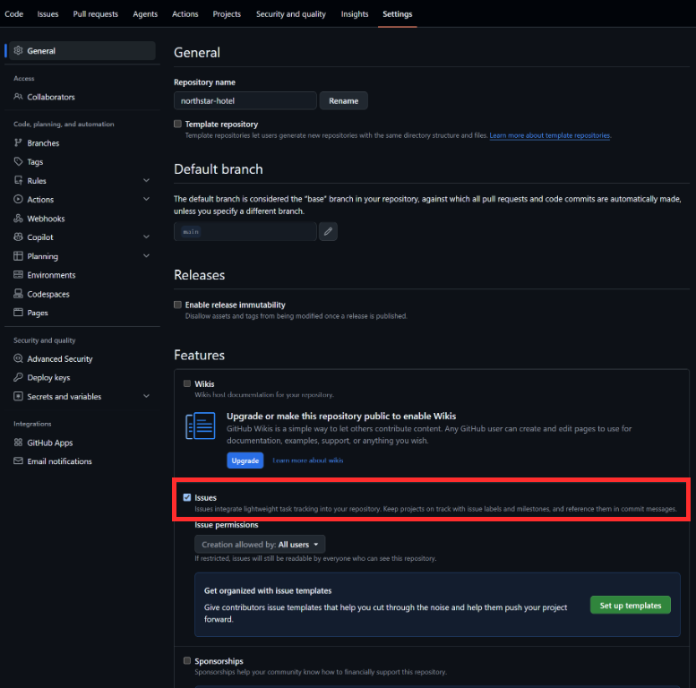
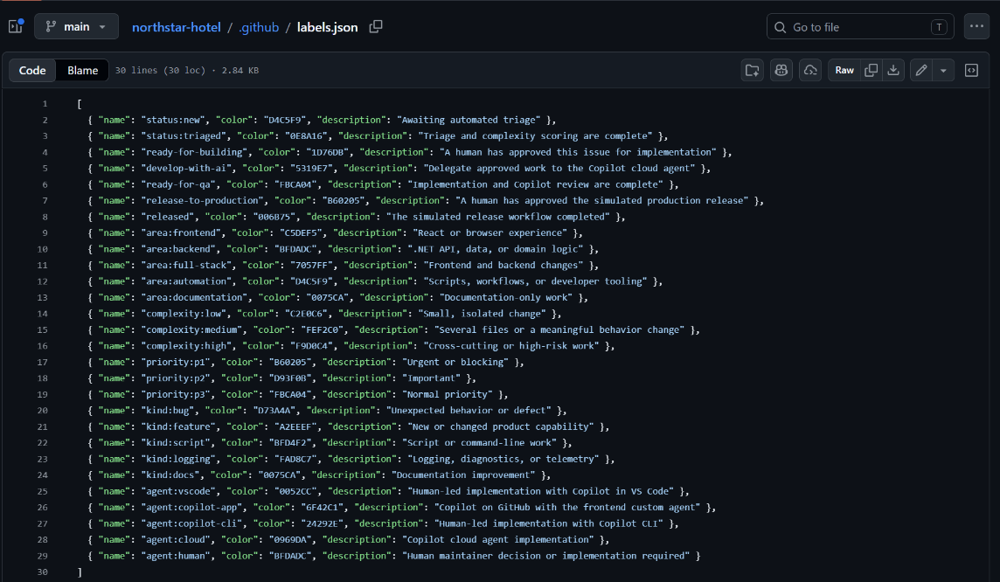
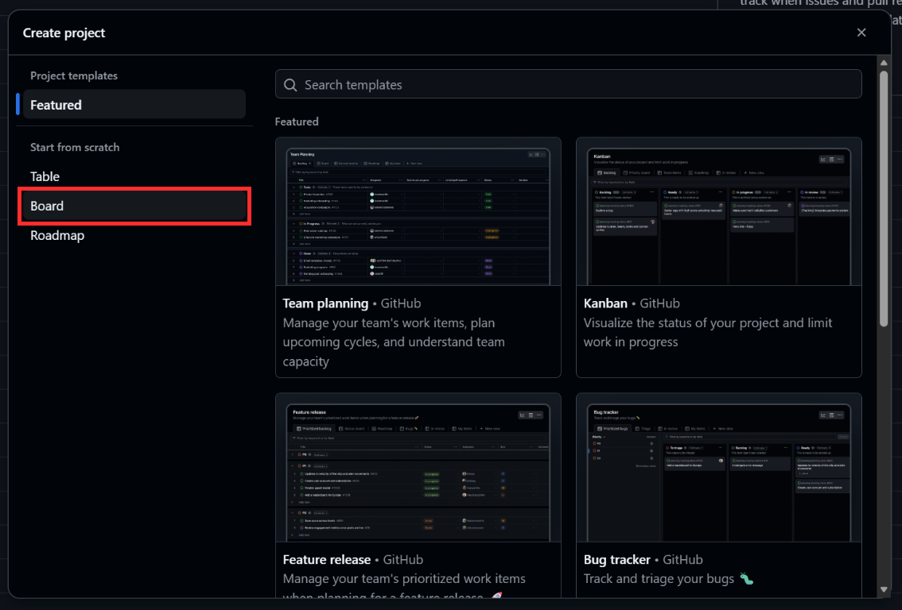
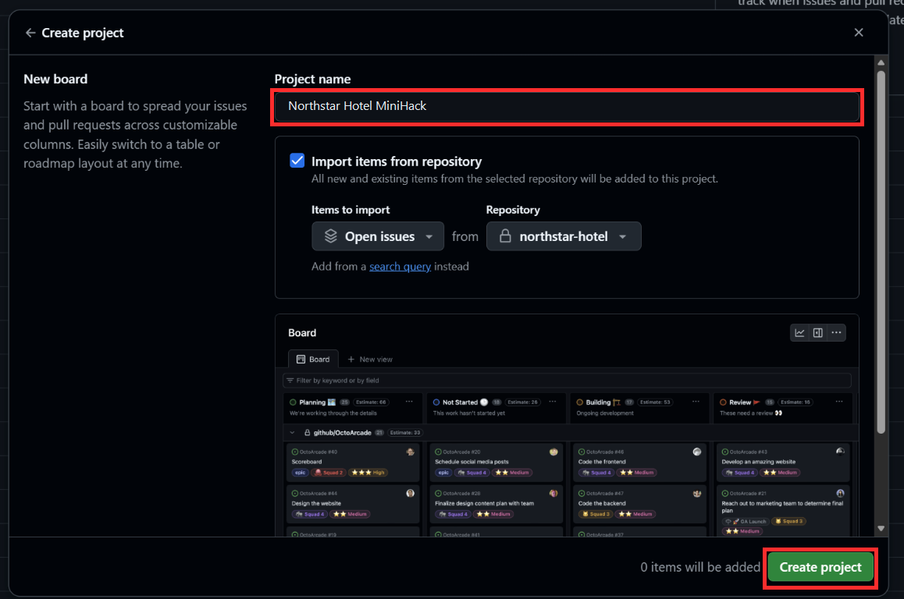
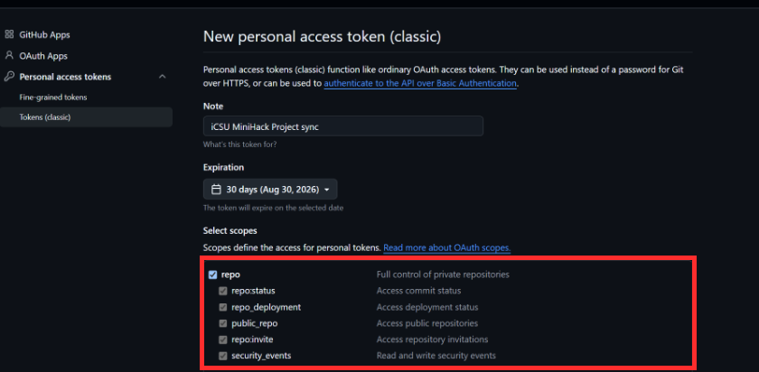

# 90-minute self-led attendee guide

## Mission

Start in an empty repository and deliver one Northstar Hotel requirement through this lifecycle:

`Issue -> triage -> human approval -> route -> implementation -> Copilot review -> QA -> simulated release`

Keep moving when a checkpoint passes. Use the recovery path only when it does not.

## Before the 90-minute clock - Complete GitHub setup

Complete this section once for your workshop repository before starting Phase 0. If the facilitator manages organization tokens centrally, complete the visible repository settings and ask the facilitator to add the two secrets.

### A. Create the empty repository and copy the workshop kit

1. Create an empty GitHub repository named for example `northstar-hotel`. Do not initialize it with a README.
2. Clone it and open it in VS Code:

   ```powershell
   gh repo clone <YOUR-OWNER-HANDLE>/northstar-hotel
   Set-Location northstar-hotel
   code .
   ```

3. Copy the workshop kit without copying the reference application:

   ```powershell
   git remote add workshop https://github.com/cihanduruer/ai-sdlc-ghcp.git
   git fetch workshop main
   git checkout workshop/main -- .github .vscode .editorconfig .gitignore .npmrc
   git add .
   git commit -m "Add iCSU MiniHack AI SDLC kit"
   git push -u origin main
   ```

**Expected evidence:** the repository contains `.github`, `.vscode`, `.editorconfig`, `.gitignore`, and `.npmrc`, but does not contain a `src` folder.

**Recovery:** if `git checkout workshop/main` fails, download the workshop repository ZIP and copy only those five paths.

### B. Configure the mandatory NPM feed

Run:

```powershell
npm config set registry https://packagefeedproxy.microsoft.io/npm/
npm config get registry
```

The second command must return `https://packagefeedproxy.microsoft.io/npm/`. Do not bypass NPM Minimum Release controls; use the approved security exception process for an urgently required unavailable package version.

### C. Enable repository capabilities

In repository **Settings**:

1. Enable GitHub Actions.
2. Enable Issues.
3. Confirm Copilot cloud agent access for the repository.
4. Confirm the organization policy allows Copilot code review.

The included workflow requests Copilot review when a non-draft pull request opens, so this workshop does not require a branch ruleset. Copilot code review submits comments; it does not approve a pull request or replace required human approval.

Under **Settings > General > Features**, select **Issues**.



Under **Settings > Actions > General**, select **Allow all actions and reusable workflows**, then select **Save**.


### D. Create repository labels

Open **Actions > 00 - Set up repository labels > Run workflow**.


Select **Run workflow** in the highlighted control and run it from `main`.

**Expected evidence:** the workflow succeeds and Issues shows labels from `.github/labels.json`, including `status:triaged`, `ready-for-building`, `develop-with-ai`, and `ready-for-qa`.



The repository provides the complete label names, colors, and descriptions shown above. If the labels do not appear under **Issues > Labels**, open the failed workflow run, correct the reported permission or Actions setting, and run it again.

### E. Create the GitHub Project

1. Open your GitHub profile or organization **Projects** page and select **New project**.


2. Under **Start from scratch**, select **Board**.



3. Enter a project name, optionally import existing issues from the workshop repository, and select **Create project**.



4. Open the Project settings, select the `Status` field, and replace its options with these exact names and order:

| Order | Status |
| --- | --- |
| 1 | Backlog |
| 2 | Triage |
| 3 | Ready |
| 4 | In progress |
| 5 | QA |
| 6 | Done |

Keep the field name exactly `Status`; the workflow uses it to move issues between columns.

5. Optional: select **+ New view** and create filtered views for the repository labels. GitHub Projects cannot group directly by labels.

| View name | Filter |
| --- | --- |
| Area | `label:"area:frontend","area:backend","area:full-stack","area:automation","area:documentation"` |
| Complexity | `label:"complexity:low","complexity:medium","complexity:high"` |
| Agent | `label:"agent:vscode","agent:copilot-app","agent:copilot-cli","agent:cloud","agent:human"` |

Labels remain on the Issue; the workflow synchronizes only the Project `Status`.

**Expected evidence:** the Project opens in a Board view with the six Status columns. If **Board** is not visible during creation, select **Start from scratch** in the left menu.

### F. Configure repository variables

Repository variables are non-secret configuration values that tell the workflows **who handles local work** and **which GitHub Project to update**. Keeping these values outside the workflow files lets every attendee connect the same automation to their own username and Project without editing code.

Open **Settings > Secrets and variables > Actions > Variables**.

| Variable | What to enter | How the workflows use it |
| --- | --- | --- |
| `HUMAN_MAINTAINER` | Your GitHub username, without `@` | The daily router assigns work selected for VS Code, Copilot CLI, or human handling to this account. |
| `PROJECT_OWNER` | The account login found after `/users/` or `/orgs/` in the Project URL, without `@` | Project-sync workflows use this login to locate the Project created in Step E. This may differ from the repository owner. |
| `PROJECT_OWNER_TYPE` | `user` when the URL contains `/users/`; `organization` when it contains `/orgs/` | Tells the GitHub GraphQL API whether to search a personal account or an organization. Enter only one of these exact lowercase values. |
| `PROJECT_NUMBER` | Your Project's number from its URL | Identifies the specific Project whose `Status` field the workflows update. |

Derive the three `PROJECT_*` values from the Project URL instead of copying the examples:

1. Open the Project created in Step E and copy its URL from the browser address bar.
2. Match the URL to the correct pattern:

   | Project URL pattern | Meaning | `PROJECT_OWNER_TYPE` | `PROJECT_OWNER` | `PROJECT_NUMBER` |
   | --- | --- | --- | --- | --- |
   | `https://github.com/users/<login>/projects/<number>` | The Project belongs to a personal GitHub account. | `user` | `<login>` after `/users/` | `<number>` after `/projects/` |
   | `https://github.com/orgs/<login>/projects/<number>` | The Project belongs to a GitHub organization. | `organization` | `<login>` after `/orgs/` | `<number>` after `/projects/` |

3. Do not infer these values from the repository URL. A repository and a Project can have different owners; always use the **Project URL**.
4. Use the number immediately after `/projects/`. If the open Board URL continues with `/views/1`, ignore the view number. For example, in `/projects/12/views/1`, the Project number is `12`, not `1`.
5. Validate the values by constructing one of these URLs with your entries and opening it:
   - personal Project: `https://github.com/users/PROJECT_OWNER/projects/PROJECT_NUMBER`
   - organization Project: `https://github.com/orgs/PROJECT_OWNER/projects/PROJECT_NUMBER`
6. Continue only if that URL opens the Project created in Step E. A different Project or a 404 means at least one value is incorrect.


Use **New repository variable** once for each row in the table. These values identify destinations and are safe to store as variables; the credentials that authorize Project access are stored separately as the `PROJECT_TOKEN` secret in Step H.

After configuration, the daily router uses `HUMAN_MAINTAINER` for local or human work. The issue-triage, delegation, QA, and release workflows use the three `PROJECT_*` values with `PROJECT_TOKEN` to add the issue to the correct Project and move its `Status` through Backlog, Triage, Ready, In progress, QA, and Done.

**Expected evidence:** the **Variables** tab lists all four names, and the reconstructed Project URL opens the intended Board. Values are hidden from this guide because each attendee supplies their own. If Project Status does not update during the smoke test, repeat the URL validation before checking the token.

### G. Configure the Copilot assignment token

The workflow `GITHUB_TOKEN` cannot assign the Copilot cloud agent. This separate token lets the delegation workflow act on behalf of an authorized user after an attendee adds both `ready-for-building` and `develop-with-ai`.

Use an account that has repository write permission, Copilot cloud-agent access, and permission under your organization policy to delegate work.

1. In GitHub, select your profile picture, then **Settings**.
2. Select **Developer settings > Personal access tokens > Fine-grained tokens**.
3. Select **Generate new token** and authenticate again if prompted.
4. Enter a recognizable token name such as `iCSU MiniHack Copilot assignment`.
5. Choose the shortest practical expiration that covers the event.
6. Under **Resource owner**, select the user or organization that owns the workshop repository.
7. Under **Repository access**, choose **Only select repositories**, then select the workshop repository.
8. Under **Repository permissions**, grant:

   - Metadata: read
   - Actions: read and write
   - Contents: read and write
   - Issues: read and write
   - Pull requests: read and write

9. Select **Generate token**. If organization approval is required, wait until the token is approved and no longer marked `pending`.
10. Copy the token immediately; GitHub shows its value only once.
11. Return to the workshop repository and open **Settings > Secrets and variables > Actions**.
12. On the **Secrets** tab, select **New repository secret**.


13. Enter the exact name `COPILOT_AGENT_TOKEN`, paste the token into **Secret**, and select **Add secret**.
14. After the event, delete the repository secret and revoke or rotate the fine-grained token.

Never place the token in an issue, prompt, workflow file, screenshot, or commit.

**Expected evidence:** `COPILOT_AGENT_TOKEN` appears in the repository **Actions secrets** list; GitHub does not display its value again. During the smoke test, adding `develop-with-ai` after `ready-for-building` starts **03 - Delegate approved issue to Copilot**, and Copilot appears as the issue assignee.

**Recovery:** the cloud-agent assignment API may be controlled by enterprise policy. If the workflow reports a policy or access error, confirm that the token is approved and its owner has Copilot access. If assignment remains unavailable, manually assign Copilot from the Issue **Assignees** control.

### H. Configure the Project token

Projects v2 is outside the repository `GITHUB_TOKEN` boundary. `PROJECT_TOKEN` lets the workflows find the Project from Step E, add issues to it, and update its `Status` field. Keep this credential separate from `COPILOT_AGENT_TOKEN` because the two tokens authorize different operations.

For the workshop, use a short-lived **personal access token (classic)** with the `project` and `repo` scopes. GitHub's fine-grained tokens currently cannot access Projects owned by a personal account. For a production organization Project, prefer a GitHub App with organization Projects read/write and repository Issues read permissions.

1. In GitHub, select your profile picture, then **Settings**.
2. Select **Developer settings > Personal access tokens > Tokens (classic)**.
3. Select **Generate new token > Generate new token (classic)** and authenticate again if prompted.
4. Enter a note such as `iCSU MiniHack Project sync`.
5. Choose the shortest practical expiration that covers the event.
6. Select these scopes:

   - `project` - read and write access to Projects
   - `repo` - access to the workshop repository and its issues



The screenshot highlights `repo`. Continue scrolling in **Select scopes** and also select `project`. Do not select `admin:org`; it grants broader organization access than this workshop needs.

7. Select **Generate token**.
8. If the repository belongs to an organization that uses SAML SSO, select **Configure SSO** beside the new token and authorize the organization.
9. Copy the token immediately; GitHub shows its value only once.
10. Return to the workshop repository and open **Settings > Secrets and variables > Actions**.
11. On the **Secrets** tab, select **New repository secret**.


12. Enter the exact name `PROJECT_TOKEN`, paste the token into **Secret**, and select **Add secret**.
13. After the event, delete the repository secret and revoke the token from **Developer settings**.

Never reuse `COPILOT_AGENT_TOKEN` here or expose either token in an issue, workflow file, screenshot, prompt, or commit.

**Expected evidence:** `PROJECT_TOKEN` appears in the repository **Actions secrets** list. During the smoke test, **01 - Triage issue** adds the issue to the Project and changes its `Status` from Backlog to Triage.

**Recovery:** if Project synchronization is skipped or reports `Project ... was not found`, confirm that `PROJECT_OWNER`, `PROJECT_OWNER_TYPE`, and `PROJECT_NUMBER` match the Project URL. For an organization Project, also confirm token approval or SSO authorization and organization policy.

### I. Smoke test the configuration

#### Create the test issue

1. Open **Issues > New issue**.
2. Select **Get started** beside **Product requirement**.


3. Complete the required fields, use `Setup smoke test` as the title, and select **Submit new issue**.

#### Verify triage and Project synchronization

4. Open the repository **Actions** tab and wait for **01 - Triage issue** to finish successfully.
5. Return to the issue and confirm it has:
   - one `area:*` label,
   - one `kind:*` label,
   - one `priority:*` label,
   - one `complexity:*` label,
   - `status:triaged`, and
   - an automated triage comment.
6. Open the Project from Step E and confirm the issue is in **Triage**.

#### Approve and route the issue

7. Return to the issue and add `ready-for-building`.
8. Adding the label automatically starts **Sync issue to GitHub Project**; you do not run this workflow manually.
9. Open the repository **Actions** tab, select **Sync issue to GitHub Project**, and wait for the newest run to show a green checkmark.
10. Open the Project created in Step E. Find the `Setup smoke test` card and confirm that it moved from **Triage** to **Ready**. This proves the label-driven Project synchronization is working.
11. Return to the repository **Actions** tab.
12. In the left workflow list, select **02 - Route top ready issues**.
13. Select **Run workflow**, keep the branch set to `main`, then select the green **Run workflow** button.
14. Wait for the new workflow run to appear and finish successfully.
15. Return to the issue and confirm it has a routing comment and exactly one `agent:*` label.

#### Clean up

16. Close the temporary issue without adding `develop-with-ai`; this avoids starting Copilot implementation for the test item.

**Setup checkpoint:** the labels and triage comment exist, the Project moved from **Triage** to **Ready**, routing added exactly one `agent:*` label, all four repository variables exist, and both secret names appear in Actions settings.

**Setup recovery:** open the failed workflow run before continuing. If Project sync is skipped, recheck the `PROJECT_*` variables, `PROJECT_TOKEN` scope, and exact Status option names. If routing finds no issue, confirm the test issue is open and has both `status:triaged` and `ready-for-building`.

Official references:

- [Use Copilot cloud agent via the API](https://docs.github.com/en/copilot/how-tos/use-copilot-agents/cloud-agent/use-cloud-agent-via-the-api)
- [Configure automatic Copilot review](https://docs.github.com/en/copilot/how-tos/copilot-on-github/set-up-copilot/configure-automatic-review)
- [Automate Projects with Actions](https://docs.github.com/en/issues/planning-and-tracking-with-projects/automating-your-project/automating-projects-using-actions)

## Phase 0 - Confirm the prepared repository (0-10 minutes)

**Outcome:** the empty application repository and GitHub automation are ready for the timed hack.

1. Open the prepared repository in VS Code.
2. Confirm no `src` folder exists yet.
3. Run `npm config get registry` and confirm the approved Microsoft package feed.
4. In GitHub, confirm the setup-label workflow passed.
5. Confirm the Project, four repository variables, and two secret names exist.
6. Confirm the temporary setup smoke-test issue was closed.

**Checkpoint:** the repository has no `src` folder, labels exist, `.npmrc` points to the approved Microsoft package feed, and VS Code detects the recommended extensions.

**Recovery:** return to the matching setup subsection above and use its expected evidence to find the missing configuration.

## Phase 1 - Let VS Code Copilot create the baseline (10-30 minutes)

**Outcome:** the local hotel application runs with a seeded SQLite database.

1. Open VS Code Copilot Chat in **Agent** mode.
2. Paste:

   ```text
   Create the Northstar Hotel baseline described by the repository instructions.

   Use the frontend-design skill. Before coding, propose a compact visual plan for a sleek,
   modern boutique-hotel experience whose single job is helping a guest find and book a room.
   Preserve the Northstar identity: deep harbour green, warm coral accents, generous off-white
   space, restrained serif display headings, crisp sans-serif body copy, and compact room cards.
   Make the signature element a refined availability search card that overlaps the hero and
   clearly summarizes the selected stay. Avoid a generic admin dashboard, stock travel-template
   styling, excessive gradients, glassmorphism, and decorative animation.

   Build a responsive mobile-first layout with:
   - a concise hotel hero and clear primary action,
   - labelled check-in and check-out controls with an obvious search action,
   - scannable room cards showing room name, capacity, nightly price, and availability,
   - a focused booking form and a readable current-bookings section,
   - purposeful loading, empty, validation, success, and error states.

   Use semantic HTML, visible keyboard focus, readable contrast, status announcements, and
   reduced-motion support. Keep motion limited to one subtle, useful interaction. Do not add
   a UI framework, state library, or unnecessary design dependency.

   Use a .NET 8 minimal API with EF Core SQLite and an idempotent seeder for six rooms.
   Add a React TypeScript Vite single-page UI that lists rooms, searches by check-in/check-out,
   creates bookings, shows bookings, and cancels bookings.
   Enforce non-overlapping stays and all booking rules at the API boundary. Add focused xUnit
   integration tests. Review the rendered interface at desktop and mobile widths, remove one
   unnecessary decorative element, then run tests, lint, and production builds.
   ```

3. Confirm the proposed plan preserves the Northstar Hotel palette, makes availability search the visual signature, covers all interaction states, and remains accessible on mobile before allowing edits.
4. Accept changes in small groups. Ask Copilot to resolve any failed build rather than bypassing validation.
5. Run the application using **Terminal > Run Task > app: run**, or the commands in `README.md`.
6. Book a room, then search the same dates and confirm it becomes unavailable.
7. Commit and push the baseline.

**Checkpoint:** `http://localhost:5173` displays rooms; booking creates data; tests pass; a local `.db` file is ignored by Git.

**Recovery:** compare with the [reference implementation](https://github.com/cihanduruer/ai-sdlc-ghcp). Do not copy the whole solution unless ten minutes remain.

## Phase 2 - Create workload and observe triage (30-42 minutes)

**Outcome:** GitHub turns a requirement into scored, visible work.

1. Open **Issues > New issue > Product requirement**.
2. Choose one card from [Requirement cards](REQUIREMENT-CARDS.md) and copy its title, outcome, and acceptance criteria.
3. Submit the issue.
4. Watch **Actions > 01 - Triage issue**.
5. Inspect the labels and triage comment. Ask yourself whether the area and complexity are reasonable.
6. Open the Project and confirm Status moved to **Triage**.

**Checkpoint:** the issue has one `area:*`, `kind:*`, `priority:*`, `complexity:*`, and `status:triaged` label.

**Recovery:** rerun the setup-label workflow, edit the issue with a harmless space, and inspect the triage run logs.

## Phase 3 - Exercise human governance and routing (42-52 minutes)

**Outcome:** a person approves scope before automation chooses an execution lane.

1. Read the acceptance criteria again. Improve anything ambiguous.
2. Add `ready-for-building`.
3. Open the repository **Actions** tab.
4. In the left workflow list, select **02 - Route top ready issues**.
5. Select **Run workflow**, keep the branch set to `main`, then select the green **Run workflow** button.
6. Wait for the new run to complete successfully.
7. Return to the issue and inspect the `agent:*` label and routing comment.
8. Compare the result with the routing table in [Workflow reference](WORKFLOW.md).

For an event group, create all four requirement cards. The daily router selects the highest-ranked ready issue in each lane:

- hardest full-stack -> VS Code Copilot,
- simple frontend -> Copilot on GitHub,
- script -> Copilot CLI,
- quick logging -> Copilot cloud agent.

**Checkpoint:** the Project shows **Ready** and the issue has exactly one route label.

**Recovery:** route manually by adding the expected `agent:*` label, then continue. Record the automation mismatch for discussion.

## Phase 4 - Build with the selected Copilot surface (52-68 minutes)

**Outcome:** the issue becomes a focused branch and pull request.

### `agent:vscode`

Assign the issue to yourself. In VS Code Copilot Agent mode, run `/implement-approved-issue` or paste the prompt file. Review the plan, keep the branch focused, validate, push, and open a pull request.

### `agent:copilot-cli`

Assign the issue to yourself. From the repository root run Copilot CLI, reference the issue, and ask it to implement and validate the requirement using repository instructions. Push the branch and open a pull request.

### `agent:copilot-app` or `agent:cloud`

Add `develop-with-ai`. The delegation workflow enforces `ready-for-building`, then assigns `copilot-swe-agent[bot]`. Watch the agent session and resulting pull request.

For the event, the App lane uses the `frontend` custom agent for a small UI feature. The Cloud lane demonstrates a bounded backend fix. Both execute remotely; their distinction is the task profile and custom instructions, not a different GitHub assignee.

**Checkpoint:** a non-draft pull request exists, its body contains `Closes #<issue>`, and CI starts.

**Recovery:** if remote agent access or tokens are blocked, manually assign Copilot in the issue UI. If that is also unavailable, use VS Code Agent mode with the same issue and continue.

## Phase 5 - Review and promote to QA (68-78 minutes)

**Outcome:** code is validated and reviewed before the work item changes state.

1. Wait for **Build and test** to pass.
2. Confirm **04 - Request Copilot code review** requested Copilot.
3. Read every Copilot review comment. Apply or explicitly dismiss suggestions; Copilot comments are advice, not approval.
4. Ensure the PR remains linked to the issue with `Closes #<issue>`.
5. After Copilot submits its review, inspect **05 - Promote reviewed work to QA**.
6. Merge the pull request after event branch policy requirements are satisfied.

**Checkpoint:** the linked issue has `ready-for-qa` and the Project shows **QA**.

**Recovery:** if organization policy prevents automatic review, request Copilot from the Reviewers control. The facilitator may add `ready-for-qa` after showing evidence of a completed Copilot review.

## Phase 6 - Approve and simulate release (78-87 minutes)

**Outcome:** a final human decision produces tested release evidence but no deployment.

1. Review the acceptance criteria and CI evidence.
2. Add `release-to-production` to the issue.
3. Watch **06 - Simulate production release**.
4. Open the workflow artifact `simulated-production-release`.
5. Inspect `manifest.json` and the built `web` directory.

**Checkpoint:** all release validation passes, an artifact exists, the issue has `released`, and the Project shows **Done**.

**Recovery:** remove and re-add `release-to-production` after fixing a failed test on `main`. Never add `released` manually.

## Phase 7 - Reflect (87-90 minutes)

Write one sentence for each:

1. Which decision stayed human, and why?
2. Which Copilot surface best matched its task?
3. What evidence would you add before using this lifecycle in production?

You have completed the hack when you can show the Project moving from Triage to Done and explain every human gate.
